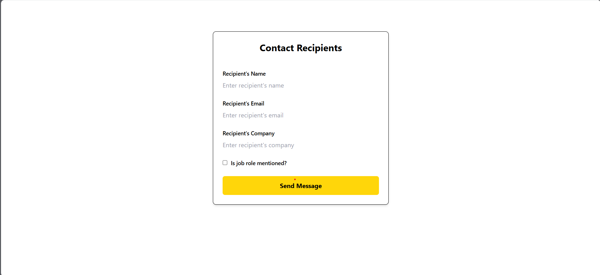
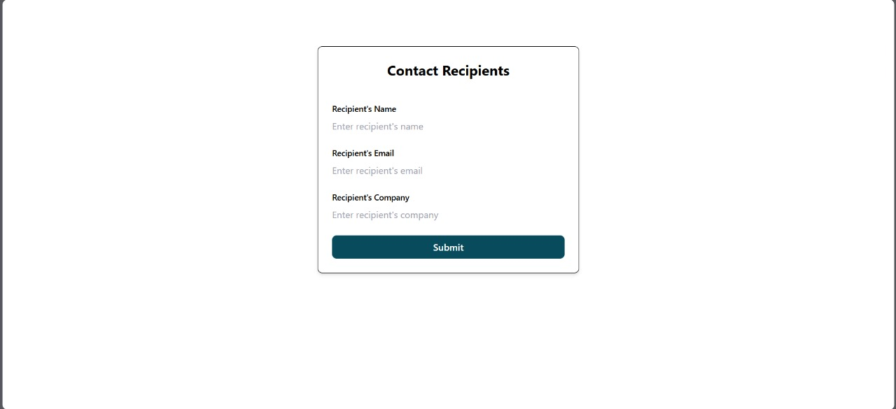
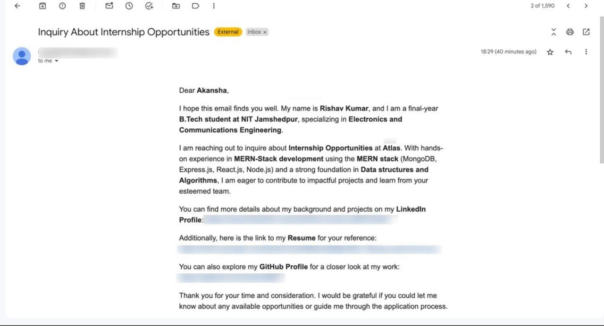

# MailSender Project (Email Sending Platform)

<video autoplay muted loop width="100%">
  <source src="assets/Videos/demo.mp4" type="video/mp4">
  Your browser does not support the video tag.
</video>




## Project Description

MailSender is a fully functional platform that enables users to send personalized emails. It features a React.js frontend and a Node.js/Express.js backend, integrated with Nodemailer for email delivery.

MailSender aims to provide:

- A seamless and secure interface for sending emails.
- Validation for recipient details to ensure proper email formatting.

In the following sections, we will cover:

1. System architecture: Overview of the platform's components.
2. Front-end: Features, tools used, and UI design.
3. Back-end: Features, tools used, and email-sending logic.
4. Setup and Deployment: Instructions to clone, install dependencies, configure, and run the project.

---

## System Architecture

The MailSender platform consists of two main components: the frontend and the backend. The platform follows a client-server architecture, where the frontend acts as the client and the backend as the server.

### Frontend

The frontend is built using React.js, which allows for dynamic and responsive user interfaces. It communicates with the backend using RESTful API calls.

### Backend

The backend is powered by Node.js and Express.js. It handles email-sending logic using Nodemailer and validates incoming data. It also ensures secure communication with the frontend.

---

## 📋 Features

- **Frontend**:
  - Responsive user interface built with React and Tailwind CSS.
  - Form validation for recipient name, email, and company details.
- **Backend**:
  - Email-sending functionality via Nodemailer.
  - CORS-enabled API endpoints for frontend communication.
  - Environment-based configuration for secure credentials.

---

## 🚀 Getting Started

### Step 1: Clone the Repository

To clone this repository to your local machine, run the following command:

```bash
git clone https://github.com/rishav9631/mailsender.git
```

### Step 2: Navigate to the Project Directory

Once the repository is cloned, navigate into the project directory:

```bash
cd mailsender
```

### Step 3: Install Dependencies

To install the necessary packages for both the backend and frontend, run:

```bash
npm install
```

This will install all required `node_modules`.

### Step 4: Set Up Environment Variables

Create a `.env` file for the backend configuration in the root directory:

#### Backend `.env` File:

```env
MAIL_HOST=smtp.gmail.com
MAIL_USER=rishavjha771@gmail.com
MAIL_PASS=your-app-password
PORT=4000
```

Replace `your-app-password` with valid email credentials.

#### Frontend `.env` File:

Create another `.env` file in the frontend folder (e.g., `frontend/.env`) and add the following:

```env
REACT_APP_BASE_URL=http://localhost:4000
```

This ensures the frontend can communicate with the backend running on port `4000`.

### Step 5: Run the Project

Start the development servers for both the backend and frontend:

```bash
npm run dev
```

- The backend will run on `http://localhost:4000`.
- The frontend will run on `http://localhost:3000`.

---

## 📂 Project Structure

```
mailsender/
├── assets/
│   └── images/
│       ├── file1.jpg
│       ├── file2.jpeg
├── backend/
│   ├── server.js
│   ├── utils/
│   │   └── mailSender.js
├── frontend/
│   ├── src/
│   │   ├── pages/
│   │   └── services/
├── .env
├── package.json
├── README.md
└── tailwind.config.js
```

---

## 🖼️ Example Screenshots

### Form Interface


### Backend Server Response


---

## ⚠️ Troubleshooting

### Common Issues

1. **CORS Error**:

   - Ensure the backend has CORS enabled. Use the `cors` middleware in your `server.js` file:
     ```javascript
     const cors = require('cors');
     app.use(cors());
     ```

2. **Nodemailer Authentication Error**:

   - Make sure you've enabled "Less Secure App Access" or used an **App Password** for your email account.
   - Double-check your `MAIL_USER` and `MAIL_PASS` values in the `.env` file.

3. **Frontend Not Connecting to Backend**:

   - Ensure that the `REACT_APP_BASE_URL` in the frontend `.env` file is correctly set (e.g., `http://localhost:4000`).

4. **Module Not Found**:

   - If you encounter a "module not found" error, make sure all paths in your import statements are correct and relative to the file structure.

---

## 📄 License

This project is licensed under the MIT License.

---

## 🙌 Contributions

Feel free to fork this repository and contribute to the project. Pull requests are welcome!

---

## 📧 Contact

For any questions or feedback, please reach out to:

- **Email**: [rishavjha771@gmail.com](mailto:rishavjha771@gmail.com)
- **GitHub**: [rishav9631](https://github.com/rishav9631)

